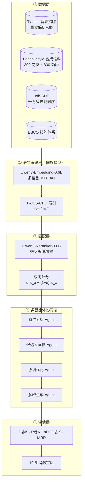
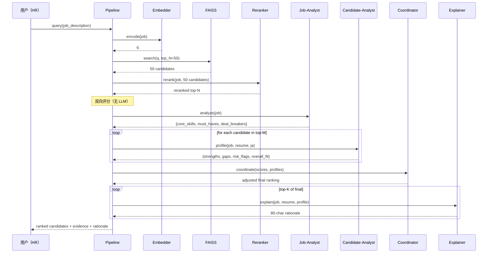
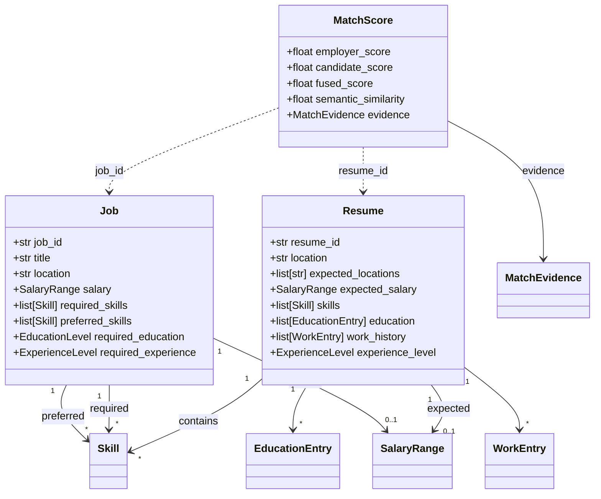

# 系统架构图（论文第 5 章）

## 总体架构（Mermaid 源码，可在 Typora/Notion/VSCode 渲染）

```mermaid
flowchart TB
    subgraph DataLayer["① 数据层"]
        Tianchi[("Tianchi 智联招聘<br/>真实简历+JD")]
        Synth[("Tianchi-Style 合成语料<br/>300 岗位 × 800 简历")]
        JobSDF[("Job-SDF<br/>千万级技能时序")]
        ESCO[("ESCO 技能体系")]
    end

    subgraph EncLayer["② 语义编码层（同族模型）"]
        Embedder["Qwen3-Embedding-0.6B<br/>多语言 MTEB#1"]
        FAISS["FAISS-CPU 索引<br/>flat / IVF"]
    end

    subgraph MatchLayer["③ 匹配层"]
        Reranker["Qwen3-Reranker-0.6B<br/>交叉编码精排"]
        BiScore["双向评分<br/>α·s_e + (1−α)·s_c"]
    end

    subgraph AgentLayer["④ 多智能体协同层"]
        JA["岗位分析 Agent"]
        CA["候选人画像 Agent"]
        Coord["协调优化 Agent"]
        Exp["解释生成 Agent"]
    end

    subgraph EvalLayer["⑤ 评估层"]
        Metrics["P@K · R@K · nDCG@K · MRR"]
        Ablation["10 组消融实验"]
    end

    DataLayer --> Embedder
    Embedder --> FAISS
    FAISS --> Reranker
    Reranker --> BiScore
    BiScore --> JA
    JA --> CA
    CA --> Coord
    Coord --> Exp
    Exp --> Metrics
    Metrics --> Ablation
```

## Agent 交互时序

```mermaid
sequenceDiagram
    participant U as 用户（HR）
    participant P as Pipeline
    participant E as Embedder
    participant F as FAISS
    participant R as Reranker
    participant J as Job-Analyst
    participant C as Candidate-Analyst
    participant K as Coordinator
    participant X as Explainer

    U->>P: query(job_description)
    P->>E: encode(job)
    E-->>P: q
    P->>F: search(q, top_N=50)
    F-->>P: 50 candidates
    P->>R: rerank(job, 50 candidates)
    R-->>P: reranked top-N
    Note over P: 双向评分（无 LLM）
    P->>J: analyze(job)
    J-->>P: {core_skills, must_haves, deal_breakers}
    loop for each candidate in top-M
        P->>C: profile(job, resume, ja)
        C-->>P: {strengths, gaps, risk_flags, overall_fit}
    end
    P->>K: coordinate(scores, profiles)
    K-->>P: adjusted final ranking
    loop top-K of final
        P->>X: explain(job, resume, profile)
        X-->>P: 80-char rationale
    end
    P-->>U: ranked candidates + evidence + rationale
```

## 数据契约层（Pydantic 模型关系）

```mermaid
classDiagram
    Resume "1" --> "*" Skill : contains
    Resume "1" --> "*" EducationEntry
    Resume "1" --> "*" WorkEntry
    Resume "1" --> "0..1" SalaryRange : expected
    Job "1" --> "*" Skill : required
    Job "1" --> "*" Skill : preferred
    Job "1" --> "0..1" SalaryRange : offered
    MatchScore --> MatchEvidence : evidence
    MatchScore ..> Job : job_id
    MatchScore ..> Resume : resume_id

    class Resume {
        +str resume_id
        +str location
        +list[str] expected_locations
        +SalaryRange expected_salary
        +list[Skill] skills
        +list[EducationEntry] education
        +list[WorkEntry] work_history
        +ExperienceLevel experience_level
    }
    class Job {
        +str job_id
        +str title
        +str location
        +SalaryRange salary
        +list[Skill] required_skills
        +list[Skill] preferred_skills
        +EducationLevel required_education
        +ExperienceLevel required_experience
    }
    class MatchScore {
        +float employer_score
        +float candidate_score
        +float fused_score
        +float semantic_similarity
        +MatchEvidence evidence
    }
```
